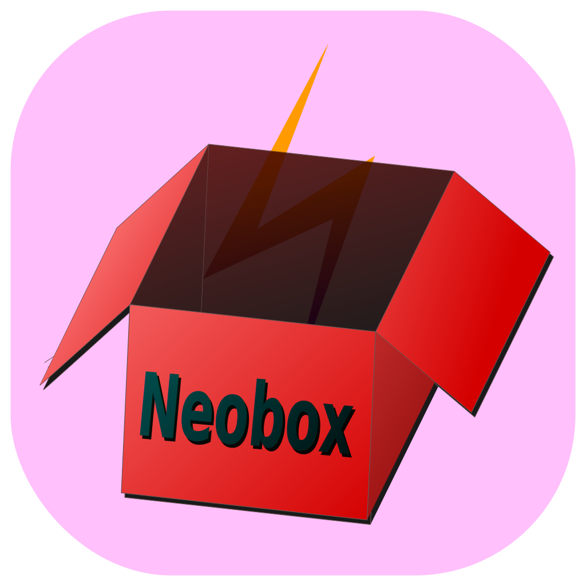

#  Neobox


[](https://raw.githubusercontent.com/yjmthu/Neobox/master/LICENSE)
[](https://github.com/yjmthu/Neobox/stargazers)
[](https://github.com/yjmthu/Neobox/network/members)

[](https://github.com/yjmthu/Neobox/issues)
[](https://github.com/yjmthu/Neobox/issues)
[](https://github.com/yjmthu/Neobox/releases/latest)


- Qt6和C++20写的一个插件管理工具。安装相关插件后可获取网速显示、壁纸切换、文本翻译、文字识别、天气预报等任何功能。

## Neobox 插件管理

目前 Neobox 共有 **8** 款插件，源代码在 `plugins` 目录下。插件二进制文件可在 [](https://gitlab.com/yjmthu1/neoboxplg) 中查看。

- 插件下载方式
    1. `托盘图标` `右键菜单` `设置中心` `插件管理`，打开 Neobox 插件管理；
    2. 在插件管理窗口里面即可下载、更新、卸载插件。

- 插件下载界面


## 插件详情

<details open="open">
<summary style="font-size:17pt;">网速悬浮</summary>

功能：网速、内存、CPU占用显示。

#### 内置皮肤


> <del>原谅我的美术造诣，感觉都不是特别完美。</del>你可以使用内置的这几种皮肤，也可以自己创建一个独特的皮肤。皮肤相关问题 [](https://github.com/yjmthu/Neobox/issues/5)

#### 进程信息查看


</details>

<details>
<summary style="font-size:17pt;">壁纸引擎</summary>

+ 手动切换、定时切换、收藏夹、黑名单
+ 网络壁纸源
    - Awesome Wallpapers: <https://wallhaven.cc/>
    - Bing: <https://www.bing.com/>
    - Unsplash: <https://unsplash.com/>
    - 小歪: <https://api.aixiaowai.cn/>
    - 其他壁纸Api链接（必须是直接在浏览器打开就能看到图片的链接，例如<https://source.unsplash.com/random/2500x1600>）
+ 本地壁纸源
    - 可遍历壁纸文件夹
    - 可调用脚本获取本地壁纸路径
    - 用户收藏夹内的壁纸
+ 拖拽壁纸源
    - 如果安装了网速悬浮插件的话，可以拖拽网页或者本地的图片到悬浮窗，也是可以设置壁纸的。
+ 屏幕截图


</details>


<details>
<summary style="font-size:17pt;">极简翻译</summary>

- 简介：普通模式调用百度翻译Api，查词模式调用有道翻译Api。


- 极简翻译 **快捷键** 映射表

| 按键 | 功能 |
| --- | --- |
| <kbd>Enter</kbd> | *发送翻译请求* |
| <kbd>Ctrl</kbd> + <kbd>Enter</kbd> | 换行 |
| <kbd>Alt</kbd> + <kbd>Left</kbd> | 向前切换from语言 |
| <kbd>Alt</kbd> + <kbd>Right</kbd> | 向后切换from语言 |
| <kbd>Alt</kbd> + <kbd>Up</kbd> | 向前切换to语言 |
| <kbd>Alt</kbd> + <kbd>Down</kbd> | 向后切换to语言 |
| <kbd>Ctrl</kbd> + <kbd>M</kbd> | 切换查词模式 |
| <kbd>Tab</kbd> | 反转语言 |
| <kbd>Ctrl</kbd> + <kbd>Space</kbd> | 反转语言 |
| <kbd>Ctrl</kbd> + <kbd>Tab</kbd> | tab |
| <kbd>Esc</kbd> | 关闭窗口 |

> 技巧：拖拽文字到悬浮窗可翻译文字。

</details>

<details>
<summary style="font-size:17pt;">文字识别</summary>

- 简介：截图识别多种语言文字，目前依赖于极简翻译插件来输出识别结果。

> 在 Windows 10/11 下可直接调用内置 Ocr 引擎，也可以使用 Tesseract。使用Tesseract需要[下载语言数据](https://tesseract-ocr.github.io/tessdoc/Data-Files.html)。


| 按键 | 功能 |
| --- | --- |
| <kbd>esc</kbd> | 退出截屏 |

> 技巧： 1. 如果只需要识别简体中文和英文，选择 `chi_sim` 即可，选的语言种类越多识别可能 **越不准确** 。2. 截屏时，按住鼠标中键可移动选框；3. 进入截屏模式后，双击截取全屏。

</details>

<details>
<summary style="font-size:17pt;">系统控制</summary>

- 简介：提供防止息屏、右键复制、快速关机、重启、睡眠等功能。


</details>

<details>
<summary style="font-size:17pt;">热键管理</summary>

- 简介：注册并捕获系统全局热键，可调用进程或者插件。由于太方便，目前此插件已经合并到主程序。

##### 进程快捷键的应用场景

1. 关机、定时开关机。
2. 打开浏览器。例如，如果我们设置了快捷键 `Shift`+`S` 打开 Edge 浏览器，那么我们在工作的时候遇到什么问题想要搜索的时候，只需要按下这对快捷键即可打开浏览器。此外，可以使用 `Ctrl`+`W` 关闭浏览器。


</details>

<details>
<summary style="font-size:17pt;">U盘助手</summary>

- 简介：U盘管理，打开、弹出U盘。


</details>

<details>
<summary style="font-size:17pt;">颜色拾取</summary>

- 简介：模仿PowerToys Color Picker写的一个颜色拾取插件，已经具备了基本功能，颜色调整功能待开发。

### 主界面


### 拾取界面


| 按键 | 功能 |
| --- | --- |
| <kbd>esc</kbd> | 退出拾取 |
| 滚轮 | 放大或缩小细节 |

</details>

## 编译环境

> 如果只有 VS2022 + Qt6 + CMake + YJson 的环境，可以删除 `plugins` 、 `example`、`wxui` 目录，只编译主程序，不编译插件。 

- `Windows 10/11 x86_64`
    - <del>xmake+xrepo</del> **[CMake](https://cmake.org/download/)+Vcpkg**
    - [VS 2022](https://visualstudio.microsoft.com/zh-hans/vs/)
    - [Qt 6.4.1](https://www.qt.io/download)（最新版本）
    - c++20 JSON库 [YJson](https://github.com/yjmthu/YJson)
- `Arch Linux x86_64`
    - 主程序库依赖: `kde` `curl` `qt6-base`
    - 目前主程序编译成功，但无可用插件
    - 正在使用clang补写linux部分功能
    - 待 GCC13 发布后再切换到 GCC

- CMake 命令【windows】

```powershell
vcpkg install leptonica:x64-windows Tesseract:x64-windows
vcpkg integrate install
git clone https://github.com/yjmthu/Neobox.git
cd Neobox
git submodule update --init --recursive
cmake -S . -GNinja -DCMAKE_BUILD_TYPE="Debug" -B build/Debug -DCMAKE_TOOLCHAIN_FILE=${VCPKG_PATH}/scripts/buildsystems/vcpkg.cmake
cmake --build "./build/Debug"
cmake -P "./build/Debug/cmake_install.cmake"
```

> 需要在VS的提供命令行环境下执行上述命令。

- CMake 命令【linux】

```shell
sudo pacman -S qt6-base curl cmake ninja clang libc++
git clone https://github.com/yjmthu/Neobox.git
cd Neobox
git submodule update --init --recursive
cmake -GNinja -B build/Debug -S . -DCMAKE_BUILD_TYPE="Debug"
cmake --build build/Debug
cmake -P build/Debug/cmake_install.cmake
```


## 现有功能增强方向

> 预计在 `v2.3.x` 的版本内完成。

<!-- 1. 完善自定义皮肤功能，考虑使用 `Lua` 语言来编写动画；
2. 逐步增加wxWidgets部分的代码，最终取代qt。 -->

- [ ] 文字识别模仿微信加强，可在图片上选中文字；
- [x] 网速悬浮窗嵌入任务栏。
- [x] 网速悬浮窗可滚轮查看每个进程内存；
- [x] 尽量解决网速悬浮窗的闪退情况；
- [x] 插件更新功能完善，可离线管理插件、调整插件加载顺序；
- [x] 热键管理加强，增加注册失败提示，增加热键执行命令功能；
- [x] 翻译功能记住from，to语言；
- [x] 翻译功能可调节文本区域高度；
- [x] 支持设置网络代理。
- [x] 壁纸下载方式切换为异步。

## 插件开发计划

> 这是我目前打算新开发的插件，如果有什么建议或者想参与插件开发，可以联系我。

- [x] 颜色拾取（PowerToys已具备，但为了跨平台还是先简单写一个吧）
- [ ] 天气预报
- [ ] 动态壁纸
- [x] U盘助手
- [ ] 后台自动更新程序
