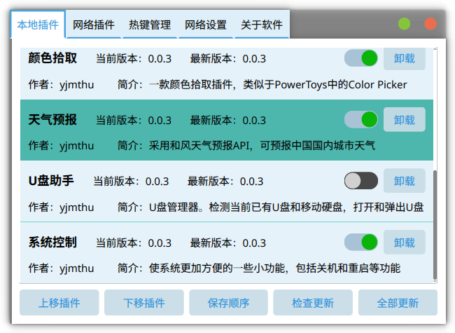

#  Neobox


[](https://raw.githubusercontent.com/yjmthu/Neobox/master/LICENSE)
[](https://github.com/yjmthu/Neobox/stargazers)
[](https://github.com/yjmthu/Neobox/network/members)

[](https://github.com/yjmthu/Neobox/issues)
[](https://github.com/yjmthu/Neobox/issues)
[](https://github.com/yjmthu/Neobox/releases/latest)


- Qt6和C++20写的一个插件管理工具。安装相关插件后可获取网速显示、壁纸切换、文本翻译、文字识别、天气预报等任何功能。

## Neobox 插件管理


- 插件下载方式
    1. `托盘图标` `右键菜单` `设置中心` `插件管理`，打开 Neobox 插件管理；
    2. 在插件管理窗口里面即可下载、更新、卸载插件。

- 插件下载界面



## 插件详情

目前 Neobox 共有 **8+１** 款插件。
- 所有插件已经移动到新仓库 <https://github.com/yjmthu/neobox-plugins>
- 插件二进制文件可在 [](https://gitlab.com/yjmthu1/neoboxplg) 中查看。

## 编译环境

- `Windows 10/11 x86_64`
    - [VS 2022](https://visualstudio.microsoft.com/zh-hans/vs/)
    - [Qt 6.5.x](https://www.qt.io/download)（最新版本）
    - cmake
    - ninja（可选）
- `Arch Linux x86_64`
    - qt6-base
    - gcc
    - curl
    - cmake
    - ninja
- `Fedora Linux x86_64`
    - qt6-base-dev
    - libcurl
    - gcc
    - cmake
    - ninja

- CMake 命令【windows】

```powershell
git clone https://github.com/yjmthu/Neobox.git
cd Neobox
git submodule update --init --recursive
cmake -S . -B -GNinja build/Debug -DCMAKE_INSTALL_PREFIX=install -DCMAKE_BUILD_TYPE="Debug"
cmake --build "./build/Debug"
cmake -P "./build/Debug/cmake_install.cmake"
```

> 需要在VS的提供命令行环境下执行上述命令。

- CMake 命令【archlinux】

```sh
sudo pacman -S qt6-base curl cmake ninja
git clone https://github.com/yjmthu/Neobox.git
cd Neobox
git submodule update --init --recursive
cmake -GNinja -B build/Debug -S . -DCMAKE_BUILD_TYPE="Debug" -DCMAKE_INSTALL_PREFIX=install
cmake --build build/Debug
cmake -P build/Debug/cmake_install.cmake
```


## 现有功能增强方向

<!-- > 预计在 `v2.3.x` 的版本内完成。 -->

<!-- 1. 完善自定义皮肤功能，考虑使用 `Lua` 语言来编写动画；
2. 逐步增加wxWidgets部分的代码，最终取代qt。 -->

- [ ] <del>文字识别模仿微信加强，可在图片上选中文字（tesseract难以实现）</del>；
- [x] 网速悬浮窗嵌入任务栏。
- [x] 网速悬浮窗可滚轮查看每个进程内存；
- [x] 尽量解决网速悬浮窗的闪退情况；
- [x] 插件更新功能完善，可离线管理插件、调整插件加载顺序；
- [x] 热键管理加强，增加注册失败提示，增加热键执行命令功能；
- [x] 翻译功能记住from，to语言；
- [x] 翻译功能可调节文本区域高度；
- [x] 支持设置网络代理。
- [x] 壁纸下载方式切换为异步。

## 插件开发计划

> 有什么好的想法欢迎提 issue。

- [x] 颜色拾取（PowerToys已具备，但为了跨平台还是先简单写一个吧）
- [x] 天气预报
- [ ] <del>动态壁纸（不写了）</del>
- [x] U盘助手
- [x] 后台自动更新程序
