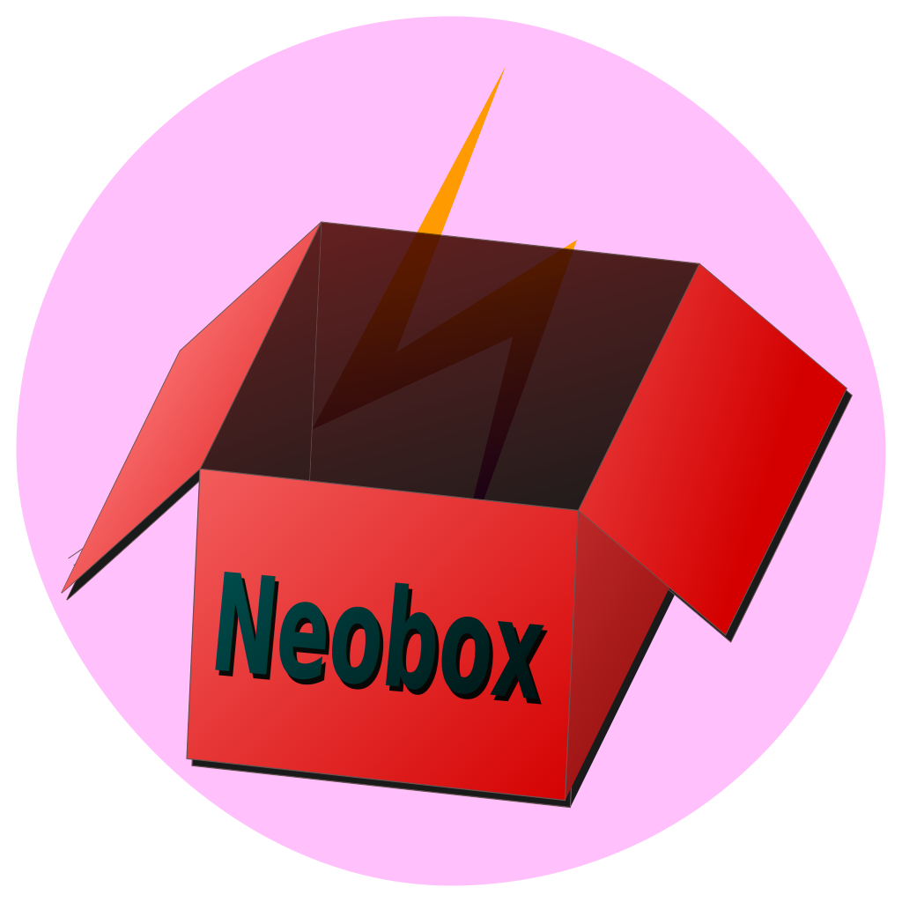

#  Neobox

 

- Qt6和C++20写的一个插件管理工具。安装相关插件后可获取网速显示、壁纸切换、文本翻译、文字识别、天气预报等任何功能。

## Neobox 插件

目前 Neobox 共有6款插件，可在  中查看。

- 插件下载方式
    1. `托盘图标` `右键菜单` `设置中心` `插件管理`，打开 Neobox 插件管理；
    2. 在插件管理窗口里面即可下载、更新、卸载插件。

- 插件下载界面

网速悬浮插件

功能：网速、内存、CPU占用显示。

1. 原生样式

    

2. 卫士样式

    

3. 管家样式

    

4. 毒霸样式

    

> 你可以使用内置的这四种皮肤，也可以自己创建一个皮肤。

壁纸引擎插件

+ 手动切换、定时切换、收藏夹、黑名单
+ 网络壁纸源
    - Awesome Wallpapers: <https://wallhaven.cc/>
    - Bing: <https://www.bing.com/>
    - Unsplash: <https://unsplash.com/>
    - 小歪: <https://api.ixiaowai.cn/>
    - 其他壁纸Api链接（必须是直接在浏览器打开就能看到图片的链接，例如<https://source.unsplash.com/random/2500x1600>）
+ 本地壁纸源
    - 可遍历壁纸文件夹
    - 可调用脚本获取本地壁纸路径
    - 用户收藏夹内的壁纸
+ 拖拽壁纸源
    - 如果安装了网速悬浮插件的话，可以拖拽网页或者本地的图片到悬浮窗，也是可以设置壁纸的。
+ 屏幕截图

极简翻译插件

- 简介：普通模式调用百度翻译Api，查词模式调用有道翻译Api。

文字识别插件

- 简介：截图识别多种语言文字，需要自行下载相应语言的训练数据。目前依赖于极简翻译插件来输出识别结果。

> 技巧：按住鼠标中键可移动选框，按ESC键退出框选。

系统控制插件

- 简介：提供防止息屏、右键复制、快速关机、重启、睡眠等功能。

热键管理插件

- 简介：注册并捕获系统全局热键，并将结果发送至相应插件。至于插件具体作何反应与此插件无关。

## 插件开发计划

> 这是我目前打算新开发的插件，如果有什么建议或者想参与插件开发，可以联系我。

1. 颜色拾取
2. 天气预报
3. 动态壁纸
4. U盘助手
5. 任务栏网速

## 编译环境

- `Windows10+ x86_64`
    - <del>xmake+xrepo</del> **[CMake](https://cmake.org/download/)+Vcpkg**
    - [MSVC 2022](https://visualstudio.microsoft.com/zh-hans/vs/)
    - [Qt 6.4.1](https://www.qt.io/download)（最新版本）
    - [vcpkg](https://github.com/microsoft/vcpkg) (libcurl[linux], leptonica, tesseract)
    - c++20 JSON库 [YJson](https://github.com/yjmthu/YJson)
- `Linux x86_64`
    - 更换系统后未曾尝试编译（待 GCC13 发布稳定后再考虑写linux部分代码）

## 开发进度

1. 完善自定义皮肤功能，考虑使用 `Lua` 语言来编写动画；
2. 逐步增加wxWidgets部分的代码，最终取代qt。
